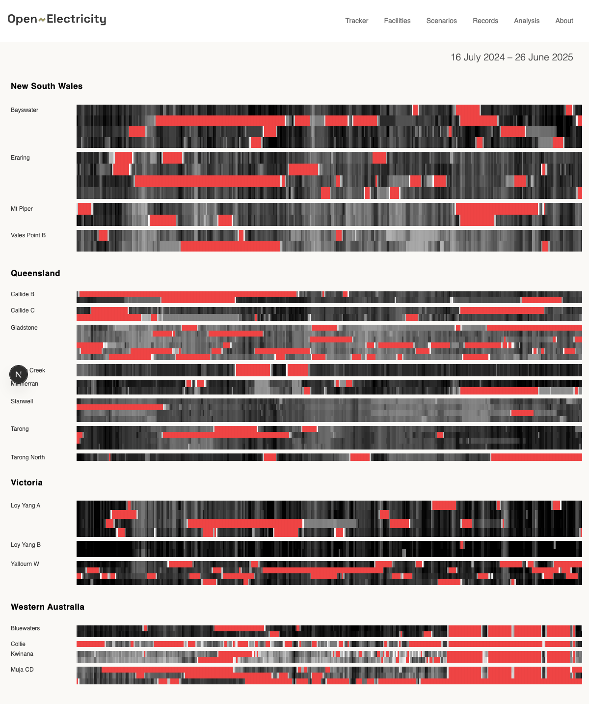

# Coal Stripes Visualisation

A simple coal availability 'stripes' visualisation (attempting to) vaguely using OpenElectricity design language.

<div align="center">

</div>

## Overview

This application visualises Australian coal power plant capacity factors over the last 365 days using a "stripes" visualisation pattern inspired by OpenElectricity. Each horizontal stripe represents a coal unit's capacity factor over the past 365 days, with grey shading indicating capacity factor (darker = higher capacity) and red indicating zero (or negligible) generation.

## Features

- **Real-time Data**: Fetches last 365 days of coal unit capacity factor data for all Australian coal units
- **Regional Grouping**: Organises data by state (NSW, QLD, VIC, WA) and groups units by facility
- **Interactive Tooltips**: Hover over any stripe to see date, facility, unit name, and capacity factor
- **Responsive Design**: Matches OpenElectricity's visual design language
- **Grey Scale Mapping**: 256 shades of grey mapping capacity factors from 0.5-100%
- **Offline Indication**: Red coloring for units with capacity factors below 0.5%

## Tech Stack

- **Next.js 15.4.1** with TypeScript and Turbopack
- **OpenElectricity API** integration via `@openelectricity/client`
- **DM Sans** font family for authentic OpenElectricity styling
- **Custom CSS** implementing OpenElectricity design patterns

## Getting Started

### Prerequisites

- Node.js 18+ 
- npm or yarn
- OpenElectricity API key

### Installation

1. Clone the repository:
   ```bash
   git clone https://github.com/simonhac/coal-stripes-viz.git
   cd coal-stripes-viz
   ```

2. Install dependencies:
   ```bash
   npm install
   ```

3. Create environment file:
   ```bash
   cp .env.example .env.local
   ```

4. Add your OpenElectricity API key to `.env.local`:
   ```env
   OPENELECTRICITY_API_KEY=your_api_key_here
   OPENELECTRICITY_API_URL=https://api.openelectricity.org.au
   NODE_ENV=development
   ENABLE_FILE_LOGGING=true  # Set to false for serverless deployments
   ```

5. Run the development server:
   ```bash
   npm run dev
   ```

6. Open [http://localhost:3000](http://localhost:3000) in your browser

### Getting an API Key

Visit [OpenElectricity](https://openelectricity.org.au) to obtain a free API key for accessing Australian electricity market data.

## Data Source

This visualisation uses data from OpenElectricity, which provides access to Australian National Electricity Market (NEM) data. The application fetches:

- All coal-fired generation units across the NEM
- Daily energy generation data for the past 365 days
- Facility information and regional groupings
- Real-time capacity factor calculations

## Project Structure

```
src/
├── app/
│   ├── page.tsx          # Main visualisation component
│   ├── opennem.css       # OpenElectricity design system styles
│   └── globals.css       # Global styles
├── hooks/
│   └── useCoalStripes.ts # Data fetching hook
├── lib/
│   ├── coal-data-service.ts # API service and data processing
│   └── types.ts          # TypeScript type definitions
└── pages/
    └── api/              # API routes for data processing
```

## Visualisation Details

- **Capacity Factor**: Calculated as daily energy generation divided by theoretical maximum (unit capacity × 24 hours)
- **Color Mapping**: Linear mapping from light grey (0.5%) to black (100%) across 256 shades
- **Regional Grouping**: Units organised by Australian states and grouped by facility
- **Time Range**: Last 365 days from current date
- **Data Points**: Approximately 18,250 data points (52 units × 365 days)

## Development Tools

The project includes several utility scripts:

- `capture-screenshot.js` — Automated screenshot capture using Puppeteer
- `test/` directory — Various API testing and data analysis scripts
- Built-in error handling for API rate limits and data availability

## Deployment

### Environment Variables

The application uses the following environment variables:

| Variable | Description | Default | Required |
|----------|-------------|---------|----------|
| `OPENELECTRICITY_API_KEY` | Your OpenElectricity API key | - | Yes |
| `OPENELECTRICITY_API_URL` | OpenElectricity API endpoint | `https://api.openelectricity.org.au` | Yes |
| `NODE_ENV` | Environment mode | `development` | No |
| `ENABLE_FILE_LOGGING` | Enable request logging to files | `true` in development, `false` in production | No |

### Vercel Deployment

When deploying to Vercel or other serverless platforms:

1. Set `ENABLE_FILE_LOGGING=false` in your environment variables
2. Add your `OPENELECTRICITY_API_KEY` to the platform's environment variables
3. The application will automatically disable file system operations in serverless environments

### Local Development

For local development, file logging is enabled by default to help with debugging API requests. Logs are stored in the `logs/` directory and automatically cleaned up after 30 days.

## Contributing

This is a demonstration project showing integration with OpenElectricity's API and design patterns. Feel free to fork and adapt for your own visualisations.

## Author
 
Created by Simon Holmes à Court [@simonhac](https://github.com/simonhac)

## License

MIT License — feel free to use and modify as needed.

## Acknowledgments

- [OpenElectricity](https://openelectricity.org.au) for API access and design inspiration
- [@nc9](https://github.com/nc9) for the OpenElectricity client library and loving curation of OE's backend
- Australian Energy Market Operator (AEMO) for underlying electricity market data
- Next.js team for the excellent development framework
- [Anthropic Claude Code](https://claude.ai/code) for development assistance and code generation
